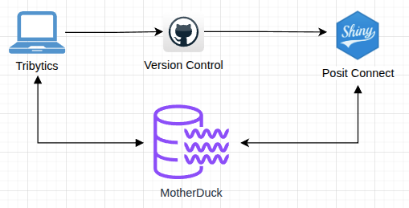
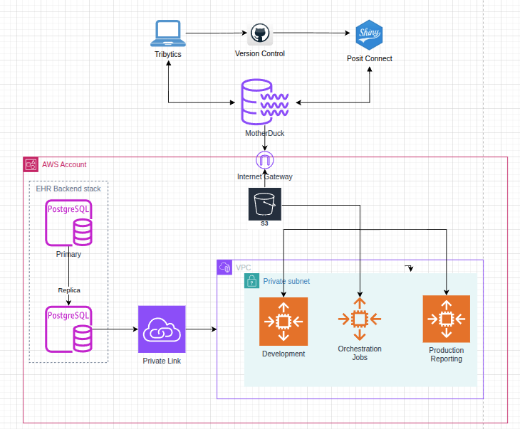
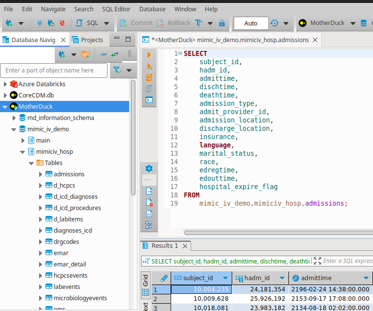

# README


[DuckDB/MotherDuck
Demo](https://019a2198-4d53-4e7e-8b8f-e42f4a8842a0.share.connect.posit.cloud/)

A minimal Shiny app on Posit Connect using MotherDuck as the datasource

#### Demo/Development environment

- Rapid development & deployment for demo projects
- Small/public datasets only
- Free (with limitations on compute/storage)
- Local development with Positron/RStudio
- Publish on Posit Connect free tier (?? products)
- MotherDuck free tier for storage \< ?? GB



#### AWS Production/more complex infrastructure

- Easily scale up for formal projects
- \$200/month minimum
- HIPAA compliant
- MotherDuck for storage engine
- Publish on AWS Shiny/Connect instance



## Connecting to MotherDuck

The `ddb_connect()` function can be used to set up a connection object:

``` r
pacman::p_load(
    duckdb,
    DBI,
    dplyr,
    glue
)

source("R/functions.R")

conn <- md_connect() 
```

When this runs, you’ll be prompted to authenticate with an MFA code in a
browser tab. To avoid this, you can generate a token from the settings
page in your MotherDuck.com profile or you can run this command:

``` r
dbExecute(conn, "PRAGMA PRINT_MD_TOKEN")
```

which will display something like this.

    export motherduck_token='<your token value>'
    [1] 0  

Save the token to `~/.Renviron` as `MD_TOKEN=<your token value>`

## Examples

### Schemas

``` r
dbGetQuery(conn, "SELECT catalog_name, schema_name FROM information_schema.schemata;")
```

               catalog_name        schema_name
    1 md_information_schema               main
    2                memory               main
    3         mimic_iv_demo               main
    4         mimic_iv_demo       mimiciv_hosp
    5         mimic_iv_demo        mimiciv_icu
    6                system information_schema
    7                system               main
    8                system         pg_catalog
    9                  temp               main

### Tables

``` r
dbGetQuery(conn, "SELECT database_name, schema_name, table_name from duckdb_tables();")
```

       database_name  schema_name         table_name
    1  mimic_iv_demo mimiciv_hosp           services
    2  mimic_iv_demo mimiciv_hosp           provider
    3  mimic_iv_demo mimiciv_hosp      prescriptions
    4  mimic_iv_demo mimiciv_hosp         poe_detail
    5  mimic_iv_demo mimiciv_hosp                poe
    6  mimic_iv_demo mimiciv_hosp           patients
    7  mimic_iv_demo mimiciv_hosp                omr
    8  mimic_iv_demo mimiciv_hosp     procedures_icd
    9  mimic_iv_demo mimiciv_hosp microbiologyevents
    10 mimic_iv_demo mimiciv_hosp           pharmacy
    11 mimic_iv_demo mimiciv_hosp          labevents
    12 mimic_iv_demo mimiciv_hosp          transfers
    13 mimic_iv_demo mimiciv_hosp        hcpcsevents
    14 mimic_iv_demo mimiciv_hosp        emar_detail
    15 mimic_iv_demo mimiciv_hosp               emar
    16 mimic_iv_demo mimiciv_hosp         d_labitems
    17 mimic_iv_demo mimiciv_hosp   d_icd_procedures
    18 mimic_iv_demo mimiciv_hosp    d_icd_diagnoses
    19 mimic_iv_demo mimiciv_hosp            d_hcpcs
    20 mimic_iv_demo mimiciv_hosp           drgcodes
    21 mimic_iv_demo mimiciv_hosp      diagnoses_icd
    22 mimic_iv_demo mimiciv_hosp         admissions
    23 mimic_iv_demo  mimiciv_icu    procedureevents
    24 mimic_iv_demo  mimiciv_icu       outputevents
    25 mimic_iv_demo  mimiciv_icu        inputevents
    26 mimic_iv_demo  mimiciv_icu           icustays
    27 mimic_iv_demo  mimiciv_icu            d_items
    28 mimic_iv_demo  mimiciv_icu   ingredientevents
    29 mimic_iv_demo  mimiciv_icu     datetimeevents
    30 mimic_iv_demo  mimiciv_icu        chartevents
    31 mimic_iv_demo  mimiciv_icu          caregiver

## Explore the mimic_iv_demo tables

If the results above do not include mimic_iv_demo tables, that indicates
that the `mimic_iv_demo` database needs to be attached to your user
account using this snippet:

``` r
-- Run this snippet to attach database
-- This will only work for Tribytics Organization members

rs <- dbExecute(conn, "ATTACH 'md:_share/mimic_iv_demo/4c53f426-2e3f-438f-ac95-9b44a1fadd16';"
```

``` r
admissions <- tbl(conn, I("mimic_iv_demo.mimiciv_hosp.admissions"))
patients   <- tbl(conn, I("mimic_iv_demo.mimiciv_hosp.patients"))

admissions |> 
    select(
        subject_id:discharge_location,
        hospital_expire_flag
       # everything()
       ) |> 
    glimpse()
```

    Rows: ??
    Columns: 10
    Database: DuckDB v1.3.0 [unknown@Linux 6.8.0-85-generic:R 4.5.1/:memory:]
    $ subject_id           <int> 10004235, 10009628, 10018081, 10006053, 10031404,…
    $ hadm_id              <int> 24181354, 25926192, 23983182, 22942076, 21606243,…
    $ admittime            <dttm> 2196-02-24 14:38:00, 2153-09-17 17:08:00, 2134-0…
    $ dischtime            <dttm> 2196-03-04 14:02:00, 2153-09-25 13:20:00, 2134-0…
    $ deathtime            <dttm> NA, NA, NA, 2111-11-15 17:20:00, NA, NA, NA, NA,…
    $ admission_type       <chr> "URGENT", "URGENT", "URGENT", "URGENT", "URGENT",…
    $ admit_provider_id    <chr> "P03YMR", "P41R5N", "P233F6", "P38TI6", "P07HDB",…
    $ admission_location   <chr> "TRANSFER FROM HOSPITAL", "TRANSFER FROM HOSPITAL…
    $ discharge_location   <chr> "SKILLED NURSING FACILITY", "HOME HEALTH CARE", "…
    $ hospital_expire_flag <int> 0, 0, 0, 1, 0, 0, 0, 0, 1, 0, 0, 0, 0, 0, 0, 0, 0…

``` r
patients |> 
    select(
        subject_id:anchor_age
        #everything()
       ) |> 
    glimpse()
```

    Rows: ??
    Columns: 3
    Database: DuckDB v1.3.0 [unknown@Linux 6.8.0-85-generic:R 4.5.1/:memory:]
    $ subject_id <int> 10014729, 10003400, 10002428, 10032725, 10027445, 10037928,…
    $ gender     <chr> "F", "F", "F", "F", "F", "F", "F", "F", "F", "F", "F", "F",…
    $ anchor_age <int> 21, 72, 80, 38, 48, 78, 46, 64, 26, 91, 60, 53, 55, 63, 57,…

## CoreCDM (minimal example)

MotherDuck is primarily designed for reading data. This means that each
database can have only one ‘writer’ or owner, but they can still be
shared for ‘reading’ by multiple users.

This code shows an example of creating a CoreCDM table for an individual
developer and then sharing it to for read-only access by other users to
in the group.

``` r
db_name <- "my_db" # this is a default personal database

#rs <- dbExecute(conn, glue("CREATE DATABASE IF NOT EXISTS {db_name}"))
rs <- dbExecute(conn, glue("USE {db_name}"))
rs <- dbExecute(conn, glue("CREATE SCHEMA IF NOT EXISTS ccdm"))

encounters <- 
    admissions |> 
    inner_join(patients, join_by(subject_id))

enc <- 
    encounters |> 
    #head() |>
    compute(name = I(glue("{db_name}.ccdm.encounters_sample")), 
            temporary = FALSE, 
            overwrite = TRUE)

enc |> 
    head() |>
    collect() |> 
    knitr::kable()
```

| subject_id | hadm_id | admittime | dischtime | deathtime | admission_type | admit_provider_id | admission_location | discharge_location | insurance | language | marital_status | race | edregtime | edouttime | hospital_expire_flag | gender | anchor_age | anchor_year | anchor_year_group | dod |
|---:|---:|:---|:---|:---|:---|:---|:---|:---|:---|:---|:---|:---|:---|:---|---:|:---|---:|---:|:---|:---|
| 10004235 | 24181354 | 2196-02-24 14:38:00 | 2196-03-04 14:02:00 | NA | URGENT | P03YMR | TRANSFER FROM HOSPITAL | SKILLED NURSING FACILITY | Medicaid | ENGLISH | SINGLE | BLACK/CAPE VERDEAN | 2196-02-24 12:15:00 | 2196-02-24 17:07:00 | 0 | M | 47 | 2196 | 2014 - 2016 | NA |
| 10009628 | 25926192 | 2153-09-17 17:08:00 | 2153-09-25 13:20:00 | NA | URGENT | P41R5N | TRANSFER FROM HOSPITAL | HOME HEALTH CARE | Medicaid | ? | MARRIED | HISPANIC/LATINO - PUERTO RICAN | NA | NA | 0 | M | 58 | 2153 | 2011 - 2013 | NA |
| 10018081 | 23983182 | 2134-08-18 02:02:00 | 2134-08-23 19:35:00 | NA | URGENT | P233F6 | TRANSFER FROM HOSPITAL | SKILLED NURSING FACILITY | Medicare | ENGLISH | MARRIED | WHITE | 2134-08-17 16:24:00 | 2134-08-18 03:15:00 | 0 | M | 79 | 2133 | 2011 - 2013 | 2134-10-28 |
| 10006053 | 22942076 | 2111-11-13 23:39:00 | 2111-11-15 17:20:00 | 2111-11-15 17:20:00 | URGENT | P38TI6 | TRANSFER FROM HOSPITAL | DIED | Medicaid | ENGLISH | NA | UNKNOWN | NA | NA | 1 | M | 52 | 2111 | 2014 - 2016 | 2111-11-15 |
| 10031404 | 21606243 | 2113-08-04 18:46:00 | 2113-08-06 20:57:00 | NA | URGENT | P07HDB | TRANSFER FROM HOSPITAL | HOME | Other | ENGLISH | WIDOWED | WHITE | NA | NA | 0 | F | 82 | 2113 | 2014 - 2016 | NA |
| 10005817 | 20626031 | 2132-12-12 01:43:00 | 2132-12-20 15:04:00 | NA | URGENT | P41R5N | TRANSFER FROM HOSPITAL | HOME HEALTH CARE | Medicare | ENGLISH | MARRIED | WHITE | NA | NA | 0 | M | 66 | 2132 | 2014 - 2016 | 2135-01-19 |

## Sharing a Database

This command will generate a `share_url` that can be sent to other users
to access using ‘ATTACH’. In our case, the default sharing mode will
make this available to group members automatically.

``` r
# use a different database name than 'my_db' 
# if you use this.

dbGetQuery(conn, glue("CREATE SHARE {db_name}"))

dbGetQuery(conn, glue("UPDATE SHARE {db_name}"))
```

## Deleting a Database

``` r
# As earlier, only use these for databased other 
# than my_db (your personal database)

rs <- dbExecute(conn, glue("DROP SHARE IF EXISTS {db_name}"))
rs <- dbExecute(conn, glue("USE md_information_schema")) # must switch to a different database first
rs <- dbExecute(conn, glue("DROP DATABASE {db_name} CASCADE;")) # deletes all schemas & tables
```

``` r
dbDisconnect(conn, shutdown = TRUE)
```

## SQL Editor

The SQL IDE integration page for
[DBeaver](https://motherduck.com/docs/integrations/sql-ides/dbeaver/)
shows the steps for setting up a connection.


